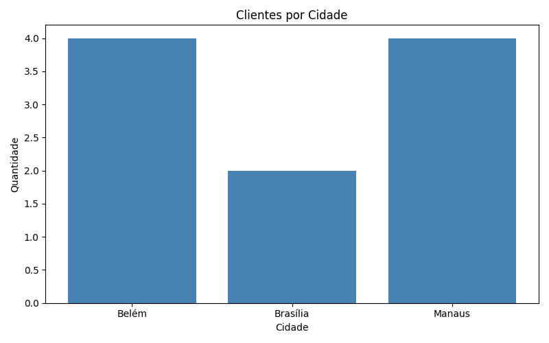
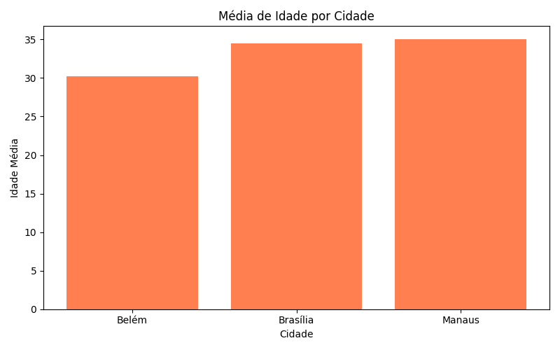
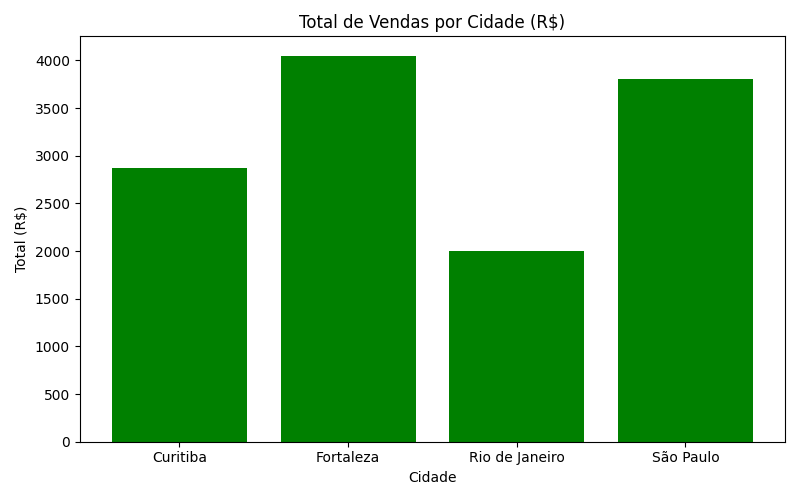
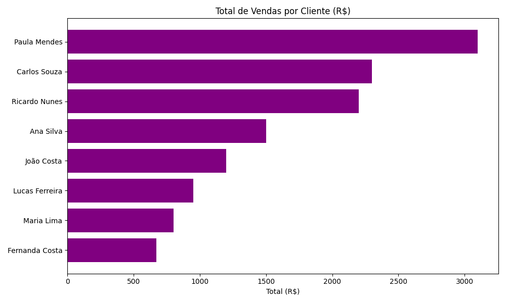

# Sales Analysis

Projeto de análise de dados usando SQL + Python + Pandas + Matplotlib.

## Visão Geral

Análise completa de clientes e vendas com banco de dados SQLite, queries SQL com JOIN e visualizações com Matplotlib.

## Tecnologias

- Python 3
- SQLite3
- Pandas
- Matplotlib

## Arquivos

| Arquivo | Descrição |
|---|---|
| `sales_analysis.py` | Análise inicial com Pandas |
| `charts.py` | 4 gráficos com Matplotlib |
| `analysis.py` | SQL JOIN entre customers e sales |

## Gráficos

### Clientes por Cidade


### Média de Idade por Cidade


### Total de Vendas por Cidade


### Total de Vendas por Cliente


## Como Executar

```bash
python3 charts.py
python3 analysis.py
```

## Autor

**JJ Domingues** — Desenvolvedor em formação, foco em dados e automação.